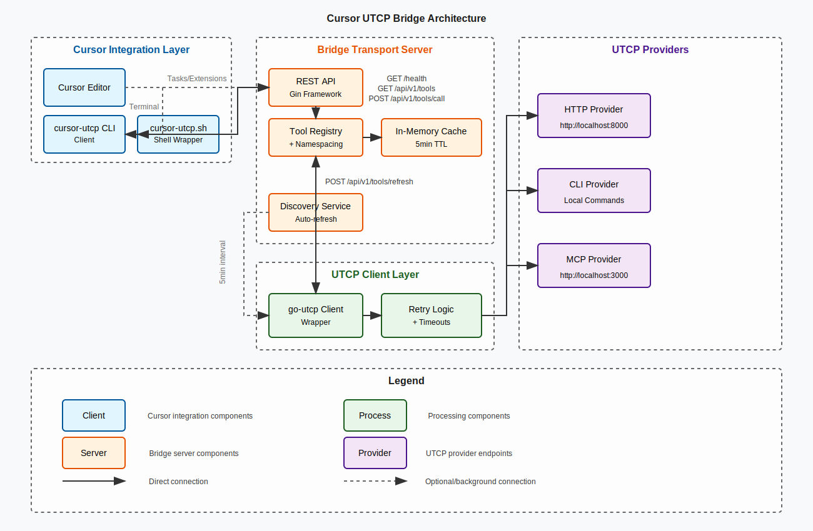

# Cursor UTCP Bridge Architecture

## System Overview

The Cursor UTCP Bridge is a server that aggregates multiple UTCP providers into a unified REST API, enabling tool discovery and execution from various sources through a single interface.

## Architecture Diagram



## Component Details

### 1. Bridge Transport Server

The core server component built with Go and Gin framework:

#### REST API Layer
- **Framework**: Gin Web Framework
- **Port**: 8080 (configurable via PORT env)
- **Endpoints**:
  - `GET /` - Service info
  - `GET /health` - Health status
  - `GET /api/v1/tools` - List/search tools
  - `GET /api/v1/tools/:name` - Tool details
  - `POST /api/v1/tools/call` - Execute tool
  - `POST /api/v1/tools/refresh` - Refresh cache

#### Tool Registry
- Central repository for discovered tools
- Implements tool namespacing: `provider.toolname`
- Thread-safe with RWMutex
- Maps tools to their provider clients

#### Caching Layer
- In-memory cache with 5-minute TTL
- Reduces provider query load
- Automatic expiration handling
- Manual refresh via API endpoint

#### Discovery Service
- Automatic tool discovery on startup
- Periodic refresh (5-minute intervals)
- Graceful error handling per provider
- Concurrent provider queries

### 2. UTCP Client Integration

#### Client Wrapper
- Wraps go-utcp client library
- Provider-specific client instances
- Unified error handling

#### Retry Mechanism
- Configurable retry attempts
- Exponential backoff
- Timeout enforcement (30s default)

### 3. Provider Configuration

#### Supported Provider Types
- **HTTP**: RESTful API providers
- **CLI**: Command-line tools
- **MCP**: Model Context Protocol
- **WebSocket**: Real-time streaming (extensible)
- **gRPC**: High-performance RPC (extensible)

#### Configuration Format
```json
{
  "name": "provider-name",
  "type": "http|cli|mcp|...",
  "url": "provider-endpoint",
  "auth": { "type": "none|basic|bearer" }
}
```

### 4. Client Components

#### CLI Client
- Standalone Go binary
- JSON input/output
- Command-based interface
- Environment variable support

#### Shell Wrapper
- Simplified command syntax
- Parameter parsing
- Help documentation
- Build automation

## Data Flow

### Tool Discovery Flow
1. Server startup triggers discovery
2. Each provider queried in parallel
3. Tools namespaced and registered
4. Cache populated with results
5. Background refresh every 5 minutes

### Tool Execution Flow
1. Client sends request to bridge API
2. Bridge parses provider from tool name
3. Registry lookups provider client
4. UTCP client executes tool call
5. Result returned through stack
6. Response sent to client

### Namespacing Strategy
- Format: `provider.toolname`
- Prevents naming conflicts
- Clear provider identification
- Examples:
  - `http.echo`
  - `cli.date`
  - `mcp.generate`

## Security Considerations

### Network Security
- Localhost binding by default
- CORS support for browser clients
- TLS support (extensible)

### Input Validation
- JSON schema validation
- Command injection prevention
- Timeout enforcement

## Performance Optimizations

### Concurrency
- Goroutine-based request handling
- Parallel provider discovery
- Non-blocking operations

### Resource Management
- Connection pooling per provider
- Memory-efficient caching
- Graceful shutdown handling

### Scalability
- Stateless design
- Horizontal scaling ready
- Load balancer compatible

## Error Handling

### Provider Failures
- Individual provider isolation
- Graceful degradation
- Error logging and reporting

### Tool Execution Errors
- Structured error responses
- Context preservation
- Client-friendly messages

## Monitoring

### Health Checks
- Provider connectivity status
- Tool count metrics
- Server uptime tracking

### Logging
- Structured JSON logs
- Request/response logging
- Error categorization

## Extension Points

### Adding Providers
1. Create provider JSON config
2. Place in server directory
3. Server auto-loads on startup
4. No code changes required

### Custom Middleware
- Authentication providers
- Rate limiting
- Request transformation
- Response filtering

### Tool Transformations
- Input mapping
- Output formatting
- Schema validation
- Custom wrappers
